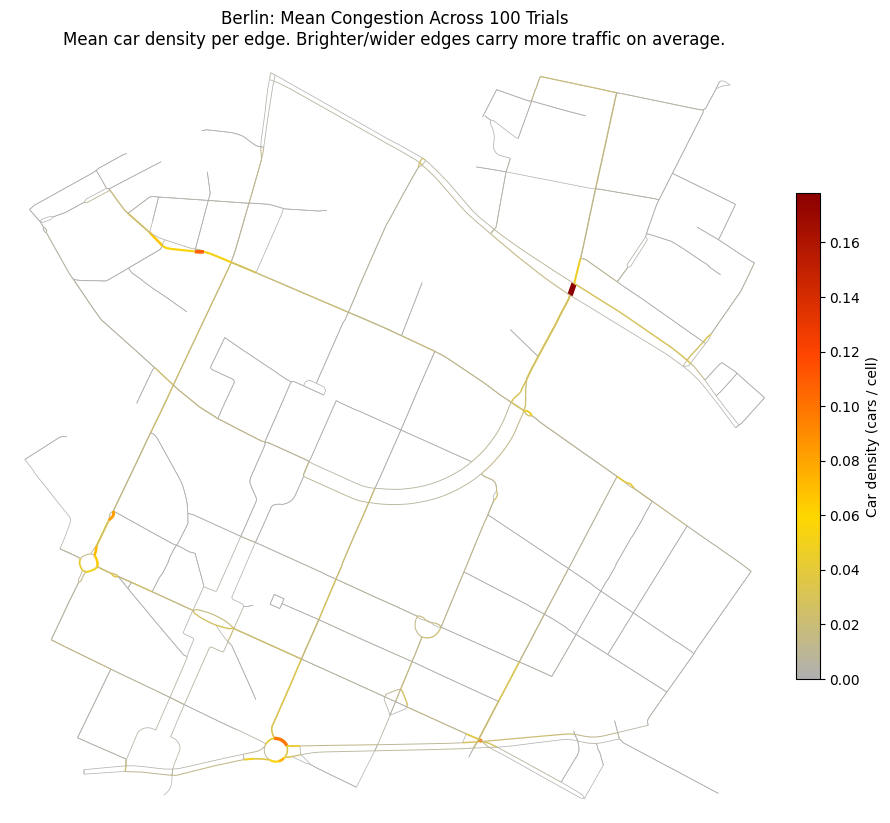
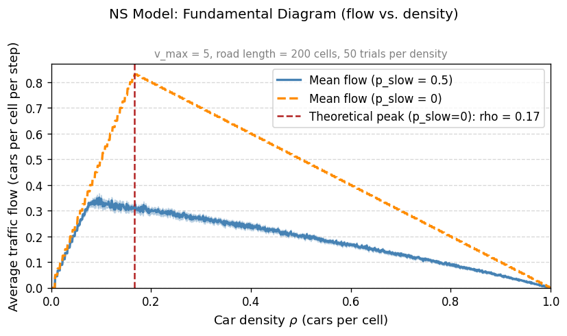
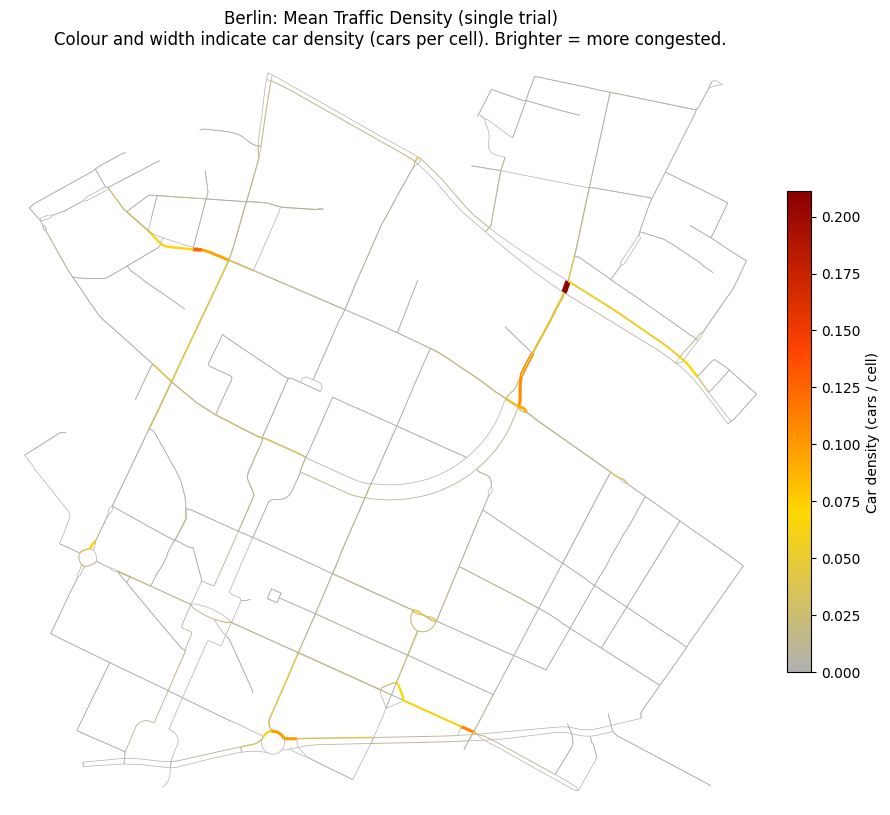
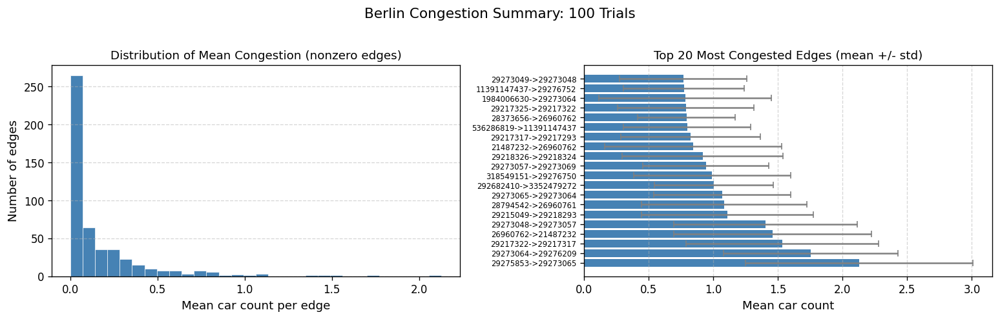
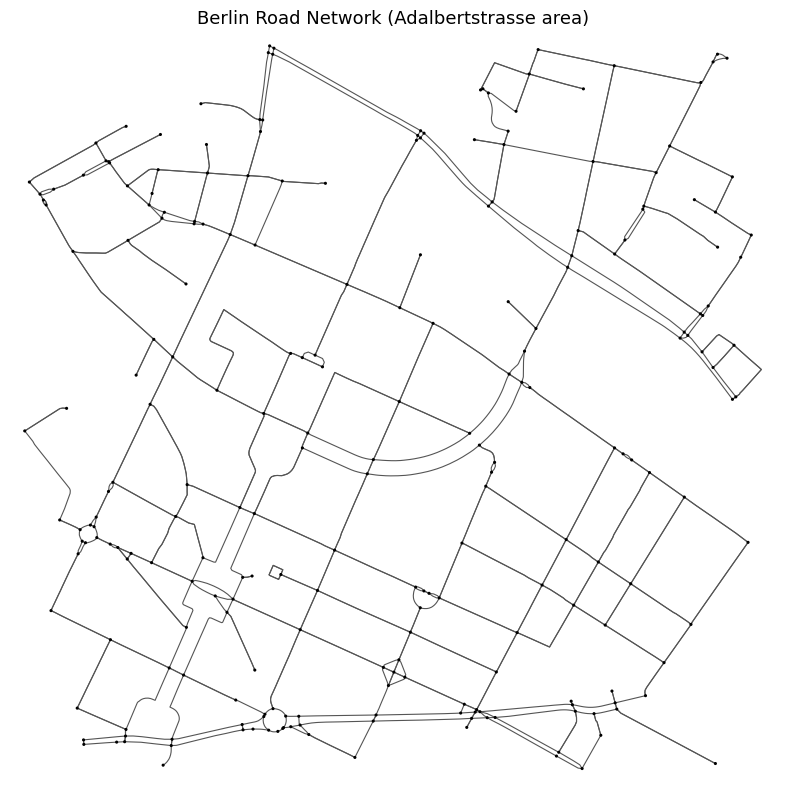
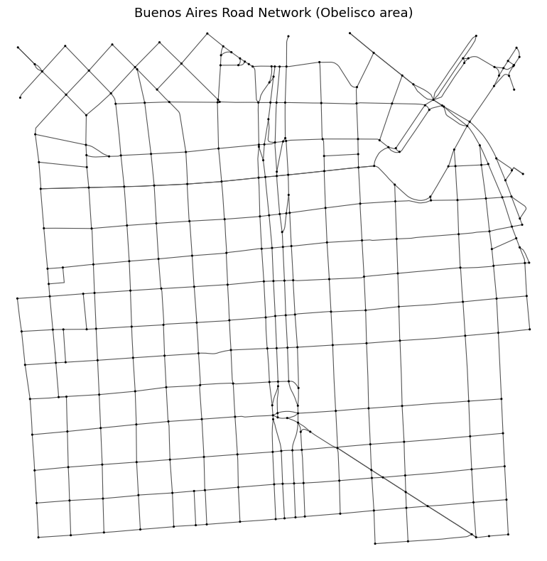
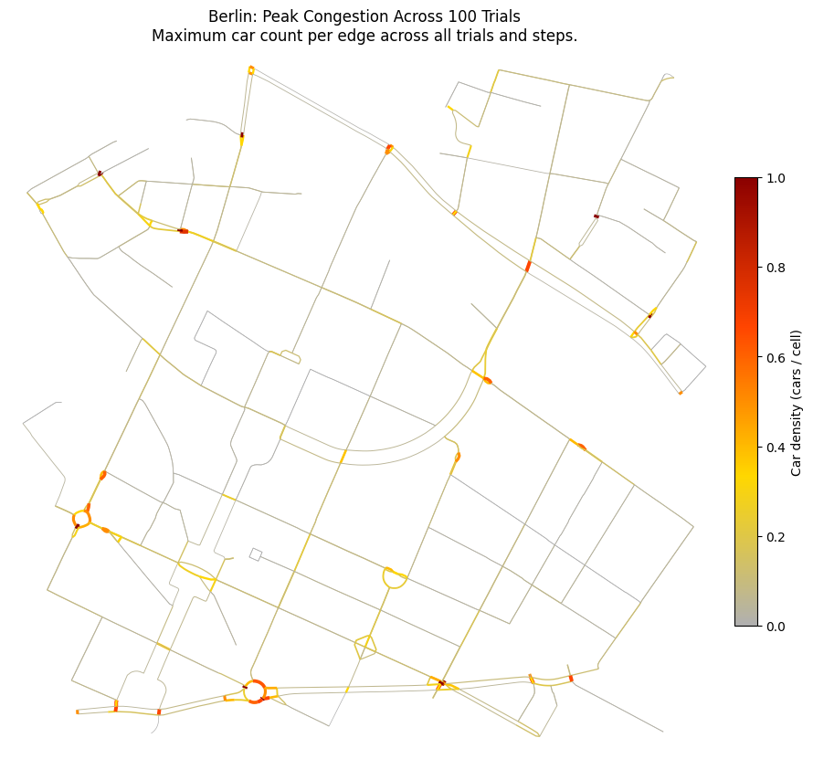
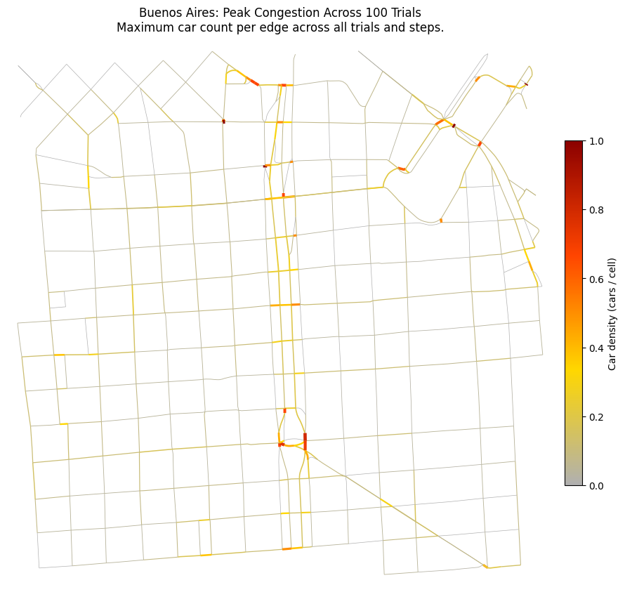
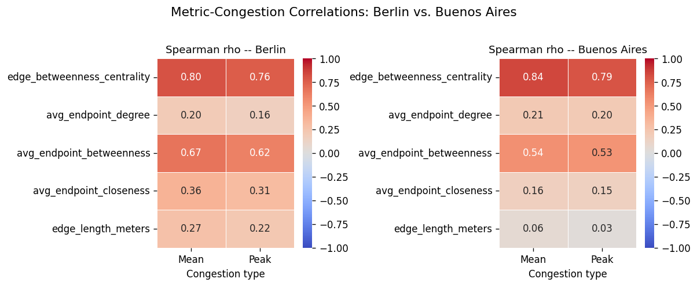
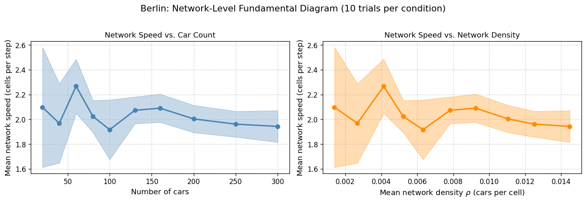

<div align="center">

# 🚦 Traffic Bottleneck Prediction

### Predicting urban traffic bottlenecks from road-network structure alone

<p>


</p>



*100 simulated rush hours in Kreuzberg, Berlin. A handful of streets go red. The rest of the city barely notices.*

</div>

---

## The question

Simulating traffic is expensive. You need a street map, a fleet of agents, a routing engine, and a lot of time steps.

So here's a cheaper idea:

> **Can you tell which streets in a city will jam — without simulating them at all?**
> Just by looking at the *shape* of the road network?

**Gridlock** is a build-it-and-find-out answer. It drops a swarm of cellular-automaton cars onto real street maps pulled live from OpenStreetMap, watches where they pile up over hundreds of independent runs, and then checks that result against five purely structural graph metrics computed from the map alone.

One metric wins, decisively, in both cities tested.

<br>

## The headline result

**Edge betweenness centrality** — the fraction of all shortest paths in the network that run through a given street — predicts simulated congestion with a Spearman rank correlation of **ρ = 0.80** in Berlin and **ρ = 0.84** in Buenos Aires. It beats every rival metric by a wide margin in both cities, and by a margin far larger than the gap between any other pair of metrics.

| Structural metric | Berlin ρ | Buenos Aires ρ | Verdict |
|---|:---:|:---:|---|
| **Edge betweenness centrality** | **0.80** | **0.84** | dominant in both |
| Mean endpoint betweenness | 0.67 | 0.54 | runner-up in both — a proxy for the above |
| Mean endpoint closeness | 0.36 | 0.16 | weak, and much weaker in Buenos Aires |
| Segment length | 0.27 | 0.06 *(n.s.)* | matters in Berlin, vanishes in Buenos Aires |
| Mean endpoint degree | 0.20 | 0.21 | consistently weak in both |

<sub>Spearman rank correlation against mean congestion over 100 independent trials per city, quoted to the precision shown in the published figure. All values except Buenos Aires segment length (p = 0.15) significant at p &lt; 0.0001.</sub>

Note what is and isn't stable across the two cities. **The top two places are identical**, and the winner's margin is enormous in both. **The bottom three reshuffle** — closeness and segment length collapse in Buenos Aires while degree holds steady — which is a finding in its own right: the weak predictors are weak in *city-specific* ways, while the strong one is strong regardless of urban form.

**Why it works, in one line:** every car takes a shortest path, so a street sitting on many shortest paths collects traffic from many origin–destination pairs no matter which pairs get sampled — which is the literal definition of betweenness centrality.

<br>

## Quickstart

```bash
git clone https://github.com/rayyanmaan/traffic-bottleneck-prediction.git
cd traffic-bottleneck-prediction
pip install -r requirements.txt
```

Run the whole study on a city from the command line (the package itself is named `gridlock`):

```bash
python -m gridlock --city berlin
```

Or point it at *any* address on Earth:

```bash
python -m gridlock --address "Shibuya Crossing, Tokyo, Japan" --trials 20
```

Want it to finish in under two minutes? Shrink everything:

```bash
python -m gridlock --city berlin --trials 3 --radius 400 --skip-sweep
```

<details>
<summary><b>Or use it as a library (six lines to a congestion map)</b></summary>

<br>

```python
from gridlock import RoadNetwork, TrafficSimulation, TrafficVisualizer

net = RoadNetwork("Adalbertstrasse 58, Berlin, Germany", radius_meters=1000)
sim = TrafficSimulation(net, num_cars=100, num_steps=50).run()

TrafficVisualizer.plot_congestion_map(net, sim.get_mean_congestion_per_edge())
```

And to ask the actual research question on your own city:

```python
from gridlock import (
    RoadNetwork, run_multiple_trials, compute_network_metrics,
    attach_congestion_to_metrics, compute_metric_correlations,
)

net = RoadNetwork("Piccadilly Circus, London, UK")
mean, std, peak = run_multiple_trials(net, num_trials=50)

table = attach_congestion_to_metrics(compute_network_metrics(net), mean, peak)
print(compute_metric_correlations(table))
```

</details>

<details>
<summary><b>Or just read the notebook</b></summary>

<br>

[`notebooks/gridlock.ipynb`](notebooks/gridlock.ipynb) is the full study, start to finish, with every figure already rendered — so you can read the whole thing on GitHub without running anything.

It runs top to bottom with no manual intervention. A complete run takes roughly 30–45 minutes, dominated by the 100-trial loops and the betweenness computation. Set `NUM_TRIALS = 5` in Section 1 for a fast pass first.

</details>

<br>

## How it works

<details open>
<summary><b>1 · Roads become cellular automata</b></summary>

<br>

The obvious way to simulate traffic on a graph is to put each car *on an edge* and add a jam rule: more than five cars on a street and everyone stops. That model is easy to write and wrong in three ways.

- **It ignores road length.** Five cars on a 20 m alley and five on a 400 m boulevard are treated identically. The alley is saturated; the boulevard is empty.
- **Congestion is binary.** Cars move freely or stop dead. Real traffic degrades *smoothly* long before anything halts.
- **The threshold is arbitrary.** "Five" is a number someone picked. There is nothing to calibrate it against.

Gridlock instead slices every street into **5-metre cells** — about one car length — and advances cars with the [Nagel–Schreckenberg](https://en.wikipedia.org/wiki/Nagel%E2%80%93Schreckenberg_model) rules:

| # | Rule | Update | What it represents |
|:-:|---|---|---|
| 1 | **Accelerate** | `v ← min(v + 1, v_max)` | drivers want to go faster |
| 2 | **Brake** | `v ← min(v, gap ahead)` | drivers don't hit the car in front |
| 3 | **Dawdle** | `v ← v − 1` with probability `p_slow` | drivers are imperfect |
| 4 | **Move** | `position ← position + v` | the car advances |

Rules 1, 2 and 4 alone give you deterministic, unrealistically smooth traffic. **Rule 3 is the interesting one:** random braking is the seed from which spontaneous phantom jams grow — the kind that appear on a motorway for no reason at all.

The payoff is that **congestion stops being a flag and becomes an emergent property**. Pack cars onto a street and braking interactions multiply on their own; mean speed falls without anyone telling it to.

</details>

<details>
<summary><b>2 · The congestion threshold is measured, not chosen</b></summary>

<br>

<div align="center">

</div>

Rather than inventing a jam threshold, Gridlock runs the same NS rules on an isolated 200-cell **ring road** — where density is a controlled input rather than an emergent outcome — and finds where flow peaks.

- With **no random braking** (`p_slow = 0`, orange), flow peaks at density **0.168** — essentially on top of the closed-form prediction `1/(v_max + 1) = 0.167`. That agreement is the implementation's validation against a known analytic result.
- With the **braking actually used** (`p_slow = 0.5`, blue), the curve compresses and the peak shifts left to **ρ = 0.096**.

So 0.096 cars per cell is the operating threshold. Above it, adding cars *reduces* flow, because cars brake more often than they can accelerate.

> **Why not just derive it?** A mean-field estimate — treating speed as falling linearly with density — predicts `ρ_opt = 0.5`, overshooting by a factor of five. It fails because it assumes cars spread out evenly, and under NS rules they don't: they **cluster**. Inside a cluster the real gap is far smaller than the mean gap, so braking fires far more often than the algebra expects. The measured 0.096 accounts for the spatial structure the approximation throws away.

Crucially, 0.096 is **not a free parameter**. It falls out of `v_max` and `p_slow`, and it moves when they move.

</details>

<details>
<summary><b>3 · Maps are coloured by density, not by car count</b></summary>

<br>

Colouring streets by raw car count produces a picture of *street length*, not of congestion. A short side street with two cars is nearly full; a long avenue with two cars is empty. Gridlock therefore colours by **local density** (`cars / cells`), which puts every street on a comparable footing, and reinforces it with a grey → gold → orange → dark-red gradient that reads like a traffic light at a glance.

<div align="center">

</div>

Even a single trial shows the concentration pattern that 100 trials later confirm: a handful of streets carry far more than the rest.

</details>

<details>
<summary><b>4 · One run proves nothing, so run it a hundred times</b></summary>

<br>

Origins and destinations are sampled at random and braking is stochastic, so any single trial confuses *streets that are structurally prone to jamming* with *streets that got unlucky*. Gridlock runs **100 independently seeded trials** and records two different things per street:

| Statistic | What it measures | Planning question it answers |
|---|---|---|
| **Mean congestion** | chronic structural load | which roads are busy *every day*? |
| **Peak congestion** | worst-case vulnerability | which roads are one bad afternoon from gridlock? |

Both are kept because a road that's moderately busy daily and a road that's empty until it seizes entirely call for completely different interventions.

<div align="center">

</div>

The distribution is sharply **right-skewed**: most streets carry almost nothing while a few carry a disproportionate share. The busiest segment averages 2.127 cars, with a peak of 7 observed at least once. That skew is exactly why every correlation here uses **Spearman's** rank coefficient — Pearson's would be dragged around by the tail.

</details>

<br>

## Two cities, one answer

The whole point of testing a second city is that it was chosen to be *as unlike the first as possible*. Berlin's Kreuzberg is a dense, irregular inner-city grid. The Obelisco in Buenos Aires is a radial, arterial-dominated network built around one of the widest avenues on Earth. Every parameter was held identical.

<table>
<tr>
<th width="50%" align="center">🇩🇪 Berlin — Adalbertstraße</th>
<th width="50%" align="center">🇦🇷 Buenos Aires — Obelisco</th>
</tr>
<tr>
<td align="center"></td>
<td align="center"></td>
</tr>
<tr>
<td align="center"><sub>236 intersections · 552 road segments<br>dense, irregular, organically grown</sub></td>
<td align="center"><sub>322 intersections · 595 road segments<br>radial, planned, arterial-dominated</sub></td>
</tr>
<tr>
<td align="center"></td>
<td align="center"></td>
</tr>
<tr>
<td align="center"><sub><b>Peak congestion.</b> Spread across several corridors.</sub></td>
<td align="center"><sub><b>Peak congestion.</b> Pinned to Av. 9 de Julio and its diagonals.</sub></td>
</tr>
</table>

<div align="center">


*Same winner. Same runner-up. Same enormous gap between them and everything else.*
</div>

That top-two stability is the real finding. It means the betweenness–congestion relationship isn't a quirk of Berlin's layout — it's a structural property of shortest-path routing that survives a change of continent, of century, and of urban planning philosophy.

The bottom three places, by contrast, **do** reshuffle: closeness drops from 0.36 to 0.16 and segment length from 0.27 to 0.06 (not significant), while degree stays flat at ~0.20. That is what you'd expect if those metrics never had a mechanism behind them in the first place — they track incidental features of a particular street layout, so they move when the layout does.

<details>
<summary><b>A closer look at the metric that swings the most</b></summary>

<br>

**Segment length** correlates moderately in Berlin (ρ = 0.270) but not significantly in Buenos Aires (ρ = 0.059, p = 0.15).

A plausible reading: in the near-uniform grid around the Obelisco, street lengths are too similar to differentiate anything. In Berlin's irregular layout, longer streets tend to span *between* distinct neighbourhoods, so they show up on cross-city shortest paths more often. But length and betweenness are confounded, and betweenness captures the effect more directly — so this is a hypothesis, not a finding.

</details>

<br>

## Does a whole city have a fundamental diagram?

A single road has a critical density: below it, more cars means more flow; above it, more cars means less. Does a whole *network* do the same thing?

<div align="center">

</div>

Sweeping the car count from 20 to 300, mean network speed **peaks at 60 cars** (2.267 cells per step) and declines after. So yes — free-flow and congested regimes both exist at city scale.

But the transition is noticeably **softer** than on a single road, and for a structural reason worth stating: **in a network, cars aren't confined to one route.** As the high-betweenness arterials fill up, traffic redistributes onto longer alternatives, delaying system-wide congestion and smearing out the regime boundary. On a ring road, a car has nowhere else to go. In a city, it does.

Past the peak, the single-street mechanism scales up: the highest-betweenness segments cross ρ_opt = 0.096 *first*, and the braking they generate propagates backward and drags down average speed everywhere.

<br>

## What's in here

```
traffic-bottleneck-prediction/
├── gridlock/                            # the library
│   ├── config.py                        # every tunable parameter, in one place
│   ├── network.py                       # RoadNetwork — OSM download, travel times, cell counts
│   ├── simulation.py                    # Car + TrafficSimulation — the NS engine
│   ├── visualize.py                     # TrafficVisualizer — density-normalised congestion maps
│   ├── analysis.py                      # fundamental diagrams, multi-trial stats, graph metrics
│   └── __main__.py                      # `python -m gridlock` CLI
├── notebooks/
│   └── gridlock.ipynb                   # the full study, every figure pre-rendered
└── report/
    ├── gridlock-technical-report.pdf    # 17-page write-up of the method and results
    └── figures/                         # all 13 figures as PNGs
```

**[Read the full technical report (PDF) →](report/gridlock-technical-report.pdf)**

<br>

## Parameters

Everything lives in [`gridlock/config.py`](gridlock/config.py).

| Parameter | Default | Meaning |
|---|:---:|---|
| `CELL_SIZE_METERS` | `5` | one cell ≈ one car length |
| `DEFAULT_MAX_SPEED` | `5` | `v_max`, in cells per step |
| `DEFAULT_PROB_SLOW` | `0.5` | `p_slow`, the dawdle probability |
| `DEFAULT_NUM_CARS` | `100` | cars per trial |
| `DEFAULT_NUM_STEPS` | `50` | time steps per trial |
| `DEFAULT_BURN_IN_STEPS` | `20` | steps discarded before recording |
| `NUM_TRIALS` | `100` | independent trials per city |
| `NETWORK_RADIUS_METERS` | `1000` | download radius around the centre address |
| `RANDOM_SEED` | `42` | base seed; trial *i* uses `RANDOM_SEED + i` |

Change `DEFAULT_MAX_SPEED` or `DEFAULT_PROB_SLOW` and **the congestion threshold moves with them** — re-derive it with `find_congestion_threshold()` rather than reusing 0.096.

<br>

## What this model does *not* do

Stated plainly, because a model you can't criticise isn't a model:

- **No traffic signals, no intersection delays.** Transfer times between streets are underestimated, which would push the real-world threshold slightly higher.
- **Uniform `p_slow` everywhere.** In reality, arterial driving involves less random braking than residential streets, so congestion on fast roads is probably overestimated and on slow roads underestimated.
- **Uniform random origin–destination pairs.** This overweights cross-city trips relative to short local ones — which, note, cuts *in favour* of the hypothesis being tested. A more realistic trip distribution should weaken the correlation, not reverse it.
- **Shortest-path routing is load-blind.** Cars never react to congestion. Under a user-equilibrium model where drivers avoid jams, load would spread more evenly and betweenness would predict less well. The correlation is a property of *this routing model*, not of topology in the abstract.
- **Rankings, not magnitudes.** Treat the ordering of streets as the output. The absolute car counts are not forecasts.
- **Live data.** Networks are downloaded from the Overpass API at runtime, so results shift as OpenStreetMap is edited. The committed figures were generated in April 2026.

<br>

## References

- Boeing, G. (2017). [OSMnx: New methods for acquiring, constructing, analyzing, and visualizing complex street networks](https://doi.org/10.1016/j.compenvurbsys.2017.05.004). *Computers, Environment and Urban Systems*, 65, 126–139.
- Brandes, U. (2001). [A faster algorithm for betweenness centrality](https://doi.org/10.1080/0022250X.2001.9990249). *Journal of Mathematical Sociology*, 25(2), 163–177.
- Nagel, K., & Schreckenberg, M. (1992). [A cellular automaton model for freeway traffic](https://doi.org/10.1051/jp1:1992277). *Journal de Physique I*, 2(12), 2221–2229.
- Sayama, H. (2015). [*Introduction to the Modeling and Analysis of Complex Systems*](https://open.umn.edu/opentextbooks/textbooks/233). Open SUNY Textbooks.

<br>

## License

[MIT](LICENSE) — road network data © OpenStreetMap contributors, available under the [ODbL](https://www.openstreetmap.org/copyright).

<div align="center">
<br>
<sub>Built with OSMnx, NetworkX, and a lot of simulated impatience.</sub>
</div>
